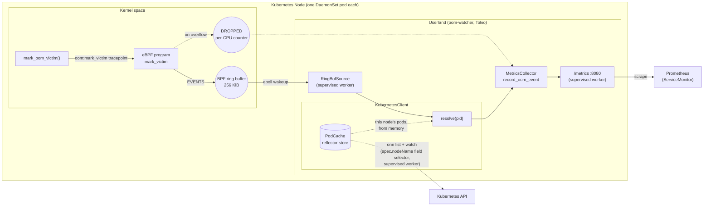

# eBPF OOM Watcher

An eBPF-based Out-of-Memory (OOM) event monitor for Kubernetes that captures OOM events with pod and container context, exposing detailed metrics via Prometheus.

## Features

- **eBPF-based OOM Detection**: Uses kernel tracepoints to capture OOM events in real-time
- **Kubernetes Integration**: Automatically identifies pods and containers where OOMs occur
- **Prometheus Metrics**: Comprehensive metrics for monitoring and alerting
- **DaemonSet Deployment**: Runs on all nodes to provide cluster-wide OOM visibility
- **Multi-Architecture**: Supports AMD64 and ARM64 platforms

## Quick Start

### Kubernetes Deployment

```bash
# Build and push image
docker build -t ghcr.io/perun-engineering/ebpf-oom-watcher:latest .
docker push ghcr.io/perun-engineering/ebpf-oom-watcher:latest

# Deploy using kubectl
kubectl apply -f k8s/daemonset.yaml

# Or using Helm
helm install oom-watcher helm/oom-watcher \
  --set image.tag=latest \
  --set serviceMonitor.enabled=true
```

### Local Development

```bash
# Set up development environment
./scripts/setup-dev.sh

# Build and test
./scripts/build-and-test.sh

# Run locally (requires Linux and root privileges)
sudo ./target/release/oom-watcher
```

## Metrics

The OOM Watcher exposes the following Prometheus metrics on port 8080:

- `oom_kills_total{node, namespace, pod, container, container_id, image_id}` - Total number of OOM kills
- `oom_kills_per_node_total{node}` - Total OOM kills per node
- `oom_memory_usage_bytes{node, namespace, pod, container, memory_type}` - Peak memory usage at OOM time (see [Peak, not last](#peak-not-last))
- `oom_last_timestamp{node, namespace, pod, container, container_id, image_id}` - Timestamp of last OOM event
- `oom_resolution_failures_total{node, reason}` - OOM events whose PID could not be resolved to a container (`reason` is `not_found` or `error`)
- `oom_events_dropped_total{node}` - OOM events the probe could not enqueue because the ring buffer was full
- `oom_series_evicted_total{node}` - Per-container series deleted after going stale (see [Series eviction](#series-eviction))

### Peak, not last

`oom_memory_usage_bytes` holds the **largest** figure seen for each `memory_type`, not the
most recent one.

One memcg OOM routinely kills more than one process — the one that hit the limit, then the
container's init as it tears down. Both are the same container, so both write this label set,
which carries no `container_id` to tell them apart. Keeping the last write let init's
`anon_rss=0` overwrite a 64MB kill, so an alert on
`oom_memory_usage_bytes{memory_type="anon_rss"}` read zero bytes for it.

Each `memory_type` peaks independently, so one label set can pair one victim's `anon_rss`
with another's `file_rss`. Read a series as "how large did this kind get", not as one
process' snapshot.

The peak spans the series' lifetime: [series eviction](#series-eviction) deletes it once the
container stops being killed, and the next kill starts a fresh maximum from zero.

### Series eviction

`oom_kills_total`, `oom_memory_usage_bytes` and `oom_last_timestamp` are keyed on pod name,
so an OOM-looping pod mints a new series on every restart. Nothing in a Prometheus client library expires a series, so
the watcher sweeps them itself: a label set with no OOM event for `SERIES_TTL_SECONDS`
(default 30 min) is deleted, and `oom_series_evicted_total` counts the deletions. Node-scoped
metrics are never evicted — there is one of each per process.

Because `oom_kills_total` and `oom_last_timestamp` also carry `container_id`, a crashlooping
pod produces one tracked series per *restart*, each expiring on its own schedule.
`oom_memory_usage_bytes` carries no id, so every restart of the same container writes to one
shared series — that one is deleted only when the last restart naming it goes stale, never
out from under a container still being killed. Deleting it is also what resets its peak.

The TTL must stay comfortably above your scrape interval. A series deleted before it is
scraped takes its increments with it, unread.

An evicted series that reappears restarts from zero. That is the correct reading for
`rate()`: it *is* a different container.

The container labels — `namespace`, `pod`, `container`, `container_id`, `image_id` —
fall back to `unknown` when the PID could not be resolved to a container. `node` does
not: a failed resolution never erases the node we already know we are running on, so
it reads `unknown` only outside a cluster.

### Joining to the rest of the Kubernetes metrics

`container_id` and `image_id` are emitted exactly as the kubelet reports them —
`containerd://<id>` (or `docker://`, `cri-o://`) and the runtime-resolved image digest.
That is the same form `kube_pod_container_info` carries, so the two join directly on a key
that survives a restart, unlike pod name:

```promql
oom_kills_total * on (container_id) group_left (image, image_spec)
  kube_pod_container_info
```

`image_id` is empty for a container that never started, and does not multiply series: it is
functionally determined by `container_id`, so it annotates the series rather than splitting
them.

### Example Queries

```promql
# OOM rate across cluster
rate(oom_kills_total[5m])

# OOM kills by namespace
sum by (namespace) (oom_kills_total)

# Did the new build start OOMing?
sum by (image_id) (increase(oom_kills_total{namespace="prod"}[24h]))

# Peak memory at OOM by type
oom_memory_usage_bytes{memory_type="anon_rss"}
```

## Configuration

### Environment Variables

- `NODE_NAME`: Kubernetes node name (automatically set by DaemonSet)
- `METRICS_PORT`: Port for Prometheus metrics (default: 8080)
- `RUST_LOG`: Log level (default: info)
- `SERIES_TTL_SECONDS`: How long a per-container series survives its last OOM event (default: 1800). Must exceed the scrape interval
- `SERIES_SWEEP_INTERVAL_SECONDS`: How often stale series are swept (default: 300)

### Helm Chart Values

See [helm/oom-watcher/values.yaml](helm/oom-watcher/values.yaml) for all configuration options.

## Development

### Prerequisites

- Docker (recommended) or Linux with eBPF support
- Rust 1.75+ with nightly toolchain
- kubectl and Helm for Kubernetes deployment

### Setup

```bash
git clone https://github.com/Perun-Engineering/ebpf-oom-watcher.git
cd ebpf-oom-watcher
./scripts/setup-dev.sh
```

### Local Testing

```bash
# Run pre-commit hooks
pre-commit run --all-files

# Build for multiple architectures
cross build --target x86_64-unknown-linux-gnu --release
cross build --target aarch64-unknown-linux-gnu --release

# Test Helm chart
helm lint helm/oom-watcher
helm template helm/oom-watcher | kubectl apply --dry-run=client -f -

# Trigger test OOM (use with caution)
python3 scripts/trigger_oom.py
```

## Contributing

See [CONTRIBUTING.md](CONTRIBUTING.md) for development workflow, commit conventions, and contribution guidelines.

## Project Structure

```
ebpf-oom-watcher/
├── oom-watcher/           # Userland application
├── oom-watcher-ebpf/      # eBPF kernel program
├── oom-watcher-common/    # Shared data structures
├── scripts/               # Utility scripts
├── Dockerfile             # Multi-stage build (dev shell + runtime image)
└── README.md              # This file
```

## Architecture

The watcher runs as a DaemonSet — one pod per node. An eBPF program attached to
the `oom:mark_victim` tracepoint fires in kernel space on every OOM kill and
pushes a compact event to userland over a BPF ring buffer. Userland enriches it
with Kubernetes pod context and exposes Prometheus metrics that the cluster's
Prometheus scrapes via a ServiceMonitor.



- **eBPF Program**: Attaches to the `oom:mark_victim` tracepoint. The trace-entry layout is
  the one Linux 6.9 introduced, and userland asserts it against the running kernel's
  `mark_victim/format` before loading the probe — see [Kernel requirements](#kernel-requirements)
- **Userland Program**: Loads the eBPF program and reads events from a BPF ring buffer,
  woken by epoll rather than polling
- **Pod Enrichment**: Resolves the victim's pod/container from `/proc/<pid>/cgroup`, then
  matches it against an in-memory mirror of the pods scheduled on the local node
  (`spec.nodeName` field selector). That mirror costs one list plus a watch for the life of
  the process — not an API call per OOM event, which is what a kill storm used to produce
- **Event Structure**: Captures process details including PID, memory usage, and process name
- **Async Processing**: Tokio supervises the reader, the pod cache, the series sweep and the
  metrics server, so a worker crash exits the process for a DaemonSet restart

### Kernel requirements

| Requirement | Minimum | Why |
|---|---|---|
| `oom:mark_victim` extended fields | **6.9** | Before 6.9 the tracepoint carries only `pid`. The memory figures do not exist |
| BPF ring buffer (`BPF_MAP_TYPE_RINGBUF`) | 5.8 | How events reach userland |
| `CAP_BPF` / `CAP_PERFMON` | 5.8 | The pod runs unprivileged; before 5.8 these are folded into `CAP_SYS_ADMIN` |

The 6.9 requirement is enforced, not advisory: on an older kernel the tracepoint still
exists and still attaches, so the probe would report correct PIDs beside meaningless memory
figures. The watcher refuses to start instead.

Check a node before deploying to it:

```bash
./scripts/preflight-node.sh
```

## Troubleshooting

### Common Issues

1. **Permission denied**: eBPF programs require root privileges or appropriate capabilities
2. **Refuses to start, "tracepoint … does not match the layout this probe decodes"**: the
   node's kernel is older than 6.9. See [Kernel requirements](#kernel-requirements); run
   `./scripts/preflight-node.sh` on the node to confirm
3. **Every event lands on `namespace="unknown"`**: check `oom_resolution_failures_total`.
   `reason="error"` means the cgroup read itself failed — usually a missing `hostPID: true`
   or a `/proc` that is not the host's — or that the pod cache still has not listed. The
   watcher waits up to 10s for that list before processing its first event, so the second
   case means the API server was unreachable for longer than that; the logs say which
   (`Pod cache synced: N pods on node …` should appear seconds after startup, and
   `Pod cache watch error` is what to look for if it does not). `reason="not_found"` means
   the process was already reaped, which is the race the probe cannot fully win
4. **`oom_events_dropped_total` is climbing**: the ring buffer overflowed. Raise
   `EVENTS`'s size in `oom-watcher-ebpf/src/main.rs` (must stay a power-of-2 multiple of
   `PAGE_SIZE`)
5. **Memory constraints**: Large Rust builds may require sufficient memory/swap

### Docker Issues

- **SIGBUS errors**: Try increasing Docker's memory limits:
  ```bash
  docker run --memory=4g --memory-swap=8g ...
  ```
- **Build failures**: Ensure you're using the nightly toolchain with rust-src component

## License

This project is licensed under the terms of the [MIT license].

[MIT license]: LICENSE-MIT
